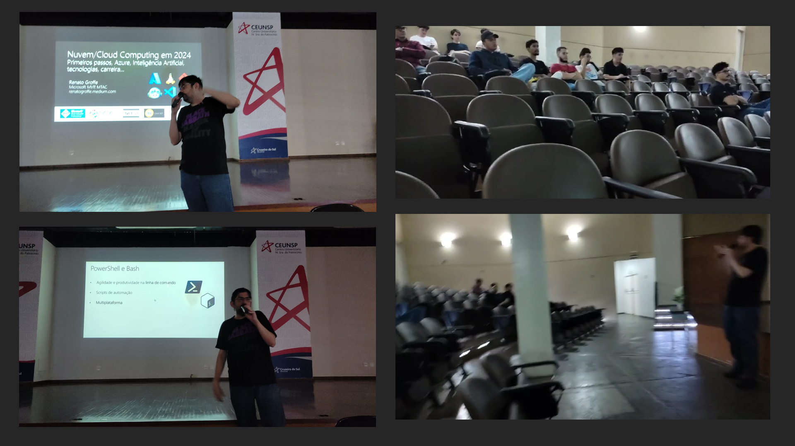

# Nuvem-IA-Mercado_CEUNSP-2024-12
Conteúdos da apresentação "Nuvem/Cloud Computing em 2024 - Primeiros passos, Azure, Containers, Inteligência Artificial, tecnologias, carreira..." para alunos do Centro Universitário Nossa Senhora do Patrocínio. Talk realizada em 04/12/2024 (quarta) na cidade de Salto-SP.

Palestrante: Renato Groffe - **Microsoft MVP, Docker Captain, MTAC**

Agradecimentos ao [**Prof. Luís Roberto Momberg Albano**](https://www.linkedin.com/in/albanolrm/) pelo convite, assim como ao [**Prof. José Luís Pagotto**](https://www.linkedin.com/in/jos%C3%A9-lu%C3%ADs-pagotto-70611835/) por todo o apoio na realização desta palestra. Deixo um obrigado ainda ao [**Waldemar Bonventi Jr.**](https://www.linkedin.com/in/waldemarbonventijr1/), que também compareceu à apresentação.

Tecnologias e tópicos abordados: **Cloud Computing, DevOps, Containers, Open Source, Cloud Native, Docker, Kubernetes, Microsoft Azure, GitHub Copilot, OpenAI, Linux, Azure DevOps, GitHub**

Número de participantes: **15 pessoas**

Local: **Praça Antônio Vieira Tavares, 73 - Centro - Salto - SP - CEP 13320-219**

---

Outras fotos e vídeos podem ser encontrados neste [**link**](/img/)
